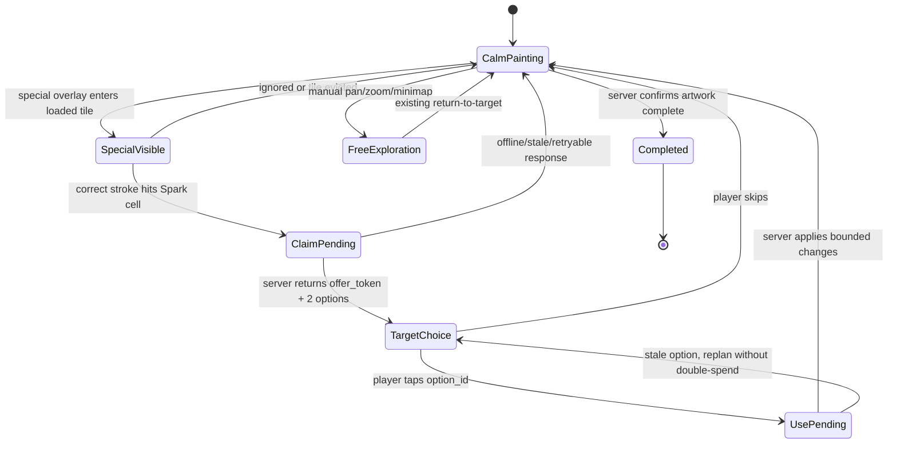

# Special Cells: финальный adversarial design review

> **Implementation status (2026-08-11).** This document began as the Spark-only
> design review. The current implementation has now advanced through the first
> multi-kind vertical slices: Spark, Bomb, Fuse, Choice, Artifact, and Hazard. The
> historical Spark-only MVP below remains the product baseline and rollback
> boundary; it is not a claim that every later slice is already product-proven.
> Current code deliberately keeps one shared `/progress/actions` contract, no
> inventory, no Jammer, no separate special-cell API, and server-derived bounded
> changes. Current balance and experiment gates are in
> `docs/SPECIAL_CELLS_BALANCE.md`; the rollout plan is in
> `docs/SPECIAL_CELLS_MVP_PLAN.md`.

The current mixed-kind placement is deterministic and tile-bounded: one
candidate for maps up to 8,192 cells, then 1/600, 1/150, or 1/175 by map tier;
no tile may contain more than eight persisted candidates, the event cap is
8,192, and Spark fills one complete server-selected 12x12 Smart target (<=144)
while the other effects keep their previous caps. Hazard is a
separate disjoint attention row with a reward cap of 16. Spark's original
6,000-cell pity/guidance rule is unchanged and does not silently apply to the
other event kinds.

Current legacy semantics: the exact 28x28 legacy fixture stays Spark-only,
while larger legacy maps use the same mixed-kind placement plus one Hazard row
and render special offers through the legacy coloring session. Client claim
detection runs after a committed stroke and checks that the committed change
matches the marker's target color; this is not limited to classic mode, so a
reveal-mode stroke can also trigger a claim in the current implementation.
The first/early candidate remains Spark for tiled and larger legacy maps, so
the INITIAL_TARGET early-discovery contract is preserved.

Статус: design only. Production-код этим документом не изменяется.

Дата review: 2026-08-08

## Решение review

Предыдущий MVP был слишком широким для проверки одной продуктовой гипотезы.
Он одновременно вводил три разных power-эффекта, trap, choice rail,
inventory, новый server state и несколько UI-состояний. Если после теста игроки
не продолжат раскрашивать, будет невозможно понять, что именно не сработало.

Окончательная версия 0:

```text
1 тип Special Cell: Spark Cell
1 одноразовый эффект: выбрать один из двух Smart Engine targets
0 inventory
0 trap
0 choice screen
1 существующий progress/actions endpoint с additive action envelope
```

Это минимальная система, которая проверяет полный моментальный цикл:

```text
заметил
→ правильно закрасил специальную клетку
→ увидел два понятных варианта
→ выбрал один Smart target
→ получил bounded server-confirmed результат
→ вернулся к обычной раскраске
```

`Bomb`, inventory, Choice Cell и trap не удаляются как идеи. Они вынесены в
последующие vertical slices и не должны входить в первую продуктовую
проверку.

---

## A. Что именно проверяется

Текущий tiled loop уже умеет:

- держать 1200×1200 metadata-only и bounded tile cache;
- загружать видимые и prefetch tiles через `ProgressiveGridClient`;
- валидировать обычные stroke в `strokeLive`;
- использовать server guidance index для глобального поиска target;
- переключать `ProgressiveColoringSession` между guided route и
  `freeExploration`;
- сохранять tiled progress по tile;
- применять `POST /colorings/:id/progress/actions` с revision/CAS,
  idempotency и server-side правильностью цвета.

Слабое место — не навигация и не сохранение, а однообразие между stroke:

```text
Smart Engine выбирает участок
→ игрок красит правильным цветом
→ Smart Engine выбирает следующий участок
```

Игрок редко принимает локальное решение. Spark Cell добавляет ровно одно:
после обнаружения нужно выбрать, на какой из двух допустимых Smart-зон
потратить одноразовый эффект. Это решение отличается от обычного выбора цвета,
но не требует инвентаря или внешней прогрессии.

### Не является целью эксперимента

- доказать ценность разных power-up типов;
- доказать ценность trap-наказаний;
- создать долгую стратегию накопления;
- измерять retention, XP или completion rewards;
- построить универсальную Special Cells framework;
- заменить Smart Engine вторым планировщиком.

---

## B. Adversarial review прежнего MVP

Оценки: `низкая`, `средняя`, `высокая`. «Стоимость удаления» означает не
количество строк кода, а количество сохранённых состояний, миграций,
клиентских edge cases и пользовательских ожиданий, которые придётся убрать.

### B.1. Spark

| Вопрос | Ответ |
|---|---|
| Новое решение | Выбрать один из 2–3 Smart targets для одноразового применения |
| Отличие | Да. Это выбор места/момента, а не цвета или следующего обычного target |
| Новый server state | Нужен только короткий одноразовый offer до выбора; inventory не нужен |
| Новый UI | Один inline target rail/chip, Canvas остаётся видимым |
| Новый API | Нет новых endpoint; additive `special_action` в existing progress action и параметр existing guidance |
| Автотесты | Высокая тестируемость: deterministic offer, target options, cap, replay, stale revision |
| Как станет неинтересным | Smart Engine сам будет выбирать лучший вариант, options окажутся почти одинаковыми или эффект будет слишком мал |
| Стоимость удаления | Низкая/средняя; удалить static metadata, один action type и один UI rail |

**Вердикт:** единственная механика, которая необходима для первой проверки.

### B.2. Bomb

| Вопрос | Ответ |
|---|---|
| Новое решение | Выбрать точку/плотный участок, где выгодно применить радиус |
| Отличие | Частично. Если target уже выбран Smart Engine, решение почти совпадает со Spark |
| Новый server state | Нет нового типа state, но нужны area-effect rules и derived changes |
| Новый UI | Radius preview и точка применения |
| Новый API | Тот же endpoint, но новый `power_type` и серверная геометрия |
| Автотесты | Хорошая: exact-color filter, radius, cap, tile boundary |
| Как станет неинтересной | Радиус слишком мал и выглядит как обычный stroke; или всегда очевидно применять в самой плотной зоне |
| Стоимость удаления | Средняя: radius preview, геометрия, cross-tile tests и server rules |

**Вердикт:** не MVP. Это хороший второй slice, если Spark доказал ценность
самого события, но не доказал разнообразие действий.

### B.3. Smart Boost

| Вопрос | Ответ |
|---|---|
| Новое решение | Сохранить/потратить эффект на неприятный разрозненный участок |
| Отличие | Слабое. Smart Engine уже должен искать полезные targets; Boost легко станет «ещё одна кнопка Next» |
| Новый server state | Offer/one-use state плюс новый objective profile |
| Новый UI | Target reason и optional target options |
| Новый API | Guidance objective и derived changes |
| Автотесты | Хорошая для planner, но качество «неприятности» плохо измеряется unit-тестом |
| Как станет неинтересной | Игрок не понимает, почему target неприятный, или Smart Engine и без этого ведёт туда |
| Стоимость удаления | Средняя/высокая: новый objective может проникнуть в guidance/index/telemetry |

**Вердикт:** не MVP. Сначала нужно доказать, что игрок вообще хочет
выбирать special target.

### B.4. Jammer

| Вопрос | Ответ |
|---|---|
| Новое решение | Теоретически заметить marker и сделать long press вместо обычного stroke |
| Отличие | Формально да, но последствия не создают хорошей стратегии |
| Новый server state | Temporary guidance suppression, trap state, disarm/trigger status |
| Новый UI | Trap marker, long-press state, warning/status chip, haptic |
| Новый API | Новый special action и временный effect в state |
| Автотесты | Технически хорошая, но тесты не докажут, что ухудшение UX весёлое |
| Как станет неинтересной | Игрок воспринимает её как «Smart Engine сломался на 8 секунд» и просто ждёт |
| Стоимость удаления | Высокая для своей ценности: long press, timer, reload, reduced motion, WebView и failure states |

**Вердикт:** удалить из MVP. Это плохой первый trap.

### B.5. Choice Cell

| Вопрос | Ответ |
|---|---|
| Новое решение | Выбрать один из двух power types |
| Отличие | Слабое в широком MVP: это ещё один слой выбора поверх уже существующего выбора target |
| Новый server state | Choice token и одноразовое claim |
| Новый UI | Choice rail, skip, focus и mobile layout |
| Новый API | Choice action/token, хотя можно встроить в progress action |
| Автотесты | Хорошая для token/replay, средняя для flow quality |
| Как станет неинтересной | Варианты слишком похожи, игрок выбирает первый или закрывает rail |
| Стоимость удаления | Средняя/высокая: token semantics, UI и accessibility states |

**Вердикт:** не MVP. В версии 0 выбор target уже является достаточным choice.

### B.6. Inventory на 2 слота

| Вопрос | Ответ |
|---|---|
| Новое решение | Потратить сейчас, сохранить, заменить active или reserve |
| Отличие | Да, но это стратегическое решение между событиями, а не обязательно moment-to-moment |
| Новый server state | Два persistent instances, replacement/discard semantics, reload sync |
| Новый UI | Два slot pills, active state, full-inventory controls |
| Новый API | Inventory в manifest/action response и дополнительные action cases |
| Автотесты | Хорошая, но число edge cases растёт непропорционально гипотезе |
| Как станет неинтересной | Power слишком слабая для хранения или настолько сильная, что игрок всегда бережёт её |
| Стоимость удаления | Высокая: persistent state уже становится частью ожиданий пользователя |

**Вердикт:** удалить из v0. Один pending Spark offer не является inventory:
его можно выбрать или пропустить сразу, но нельзя копить между событиями.

### B.7. Итог критики

Предыдущий MVP проверял сразу четыре гипотезы:

1. интересны ли сами редкие special events;
2. интересен ли выбор Smart target;
3. интересны ли разные способы server-generated painting;
4. интересна ли долгосрочная экономия power в inventory.

В v0 должна остаться только первая и вторая.

---

## C. Сравнение сокращённых вариантов

| Вариант | Что проверяет | State/UI/API cost | Главный риск | Решение |
|---|---|---:|---|---|
| A: 2 Power + 1 Trap | Событие, разные эффекты и наказание | Высокая | Trap исказит реакцию на power и сделает эксперимент неприятным | Отложить |
| B: 2 Power + Choice | Разные эффекты и meta-choice | Высокая | Нельзя отделить ценность effect от ценности choice | Отложить |
| C: 1 universal Cell с разными эффектами | Событие и выбор effect | Средняя | Универсальная клетка станет абстрактной кнопкой, а не наблюдаемым объектом | Не брать в v0 |
| D: Power без inventory, сразу выбор target | Обнаружение, решение, bounded результат, возврат к paint | Низкая | Один effect может оказаться слишком однообразным | Выбрать |
| E: 1-slot inventory | Отложенное решение и storage value | Средняя | Storage добавляет UX до доказательства базовой ценности | Отложить |

### Почему D минимален

Вариант D создаёт весь нужный цикл без persistent inventory:

```text
special marker
→ correct paint
→ 2 target options
→ tap option
→ bounded applied changes
→ обычная кисть снова активна
```

Если игрок не хочет вмешательства, есть `Skip`. Это не сохранение power и не
новый слот; просто текущая Special Cell считается просмотренной без эффекта.

### Когда понадобится 1-slot inventory

Только если наблюдение покажет одновременно:

- игроки часто хотят применить Spark, но не в текущем target;
- они понимают ценность способности и явно пытаются отложить её;
- immediate target choice вызывает отказ не из-за UI, а из-за плохого timing.

Тогда можно добавить один slot как отдельный эксперимент. Не добавлять его
заранее.

---

## D. Отдельный review Trap Cells

### Почему Jammer не проходит

Jammer формулируется как «заметил danger → long press → избежал ухудшения».
Но фактическое последствие `guidance_suppressed_until` — это временное
ухудшение уже полезной функции. Если игрок не заметил сигнал, игра не даёт
нового интересного действия: игрок ждёт, пока Smart Engine снова заработает.

У Jammer слабый skill expression:

- long press — скорее тест discoverability и timing, чем мастерство
  раскраски;
- если marker достаточно заметен, trap становится формальностью;
- если marker недостаточно заметен, trap становится случайным наказанием;
- его лучший outcome — не получить искусственно созданную проблему.

Это хуже, чем обычная редкая ошибка кисти: ошибка хотя бы сообщает о неверном
цвете и помогает учиться. Jammer не улучшает понимание картины.

### Возможная замена после v0

Если понадобится trap, использовать не Jammer, а `Fuse`:

```text
видимый fuse marker
→ long press до stroke
→ клетка обезврежена, игрок получает дополнительный target preview
→ если кисть пересекла fuse, special reward теряется,
  но progress и Smart guidance не ухудшаются
```

Это создаёт skill expression «заметить и правильно отреагировать» и не
наказывает ожиданием или потерей уже раскрашенных клеток. Но `Fuse` не входит
в v0: сначала нужно доказать, что positive event вообще нужен.

### Trap decision

В v0 traps полностью отключены. Если базовый positive event не увеличивает
интерес к раскраске, добавление negative event не исправит проблему и только
усложнит диагностику.

---

## E. Финальный MVP v0

### E.1. Spark Cell

**Игровое назначение:** дать редкую локальную развилку внутри текущей
раскраски.

**User flow:**

1. В загруженном tile виден marker `Spark`.
2. Игрок правильным цветом закрашивает cell обычным stroke.
3. Сервер подтверждает обычный progress и возвращает два Smart Engine target
   options с оценкой размера и короткой причиной.
4. В Canvas появляется inline rail: `участок A`, `участок B`, `Пропустить`.
5. Игрок выбирает target.
6. Сервер применяет максимум 32 eligible cells, возвращает progress/revision.
7. Rail исчезает; камера/Smart Engine продолжают обычный loop.

**Что решает игрок:** выбрать, какой из двух допустимых участков закрыть
сейчас. Это решение не требует угадывать правильный цвет и не дублирует
обычную кнопку «следующий участок» — оно появляется только после события и
имеет bounded effect.

**Smart Engine integration:** existing `GET /guidance` получает additive
`reason=SPECIAL_TARGETS` и возвращает максимум два target options. Server
использует существующие color totals, tile candidates, camera center и
actionable-window calculation. Новый planner не создаётся.

**Server-authoritative contract:**

- static special coordinates создаются на сервере из template + immutable
  content revision;
- tile payload отдаёт только special overlays текущего tile;
- normal paint request содержит existing `changes`;
- server валидирует цвет и отмечает Special Cell `claimed` атомарно;
- response содержит одноразовый `offer_token` и два server-generated options;
- use request содержит только `offer_token` и `option_id`, не список клеток;
- server повторно проверяет revision, token, target и exact colors;
- Spark derives the complete persisted Smart target up to 12x12 / 144 cells;
  the other effects retain their narrower caps and all pass through existing
  tiled/legacy apply;
- оба request используют `clientBatchId`; replay не повторяет grant или paint.

**Visual representation:** мягкий геометрический `⚡`/zigzag pattern,
отличимый формой и текстурой, но не крупнее обычного guide outline. Один
короткий pulse при обнаружении допустим; reduced motion использует static
outline. Rail не является modal и не скрывает Canvas.

**Verifier:**

- unit: deterministic placement, option normalization, cap and token state;
- integration: normal claim, derived bounded changes, wrong-color rejection,
  CAS and replay;
- E2E: 1200×1200 marker → paint → two options → select → server progress →
  return to normal painting at 360/390/430 px.

### E.2. Что сознательно исключено

- Bomb — нужен отдельный area-effect verifier;
- Smart Boost — качество «неприятного участка» пока субъективно и дублирует
  Smart Engine;
- Jammer/Fuse — negative/avoidance behavior не нужен для первой проверки;
- Choice Cell — target choice уже является достаточным выбором;
- inventory любого размера — storage value пока не доказана;
- timed powers, Magnet, Overbrush, Line, Fill;
- artifacts, chains, combo multipliers;
- новые экраны, XP, currency, achievements, streak и progression.

---

## F. Gameplay state machine



`TargetChoice` — временное состояние, не inventory. После skip или use
текущий offer закрывается. Reload восстанавливает только незавершённый offer,
если серверный state и idempotency ledger подтверждают его существование.

---

## G. Минимальная архитектура и API

### G.1. Данные

Нужны только две bounded сущности:

```text
coloring_special_cells
  template_id, special_id
  cell_index
  tile_x, tile_y, local_index
  kind = spark
  generation_version
```

и:

```text
coloring_special_progress
  user_id, template_id, special_id
  status = unseen | offered | consumed | skipped
  offer_revision
  offer_token_hash
  updated_at
```

В v0 не нужны `inventory_json`, power instances, chain state, trap timers,
choice token collections или отдельный special session ledger. Existing
`coloring_progress_batches` остаётся idempotency ledger для action envelope.

### G.2. Existing endpoint changes

Новые endpoint не добавляются.

#### Tile payload

Additive metadata для загруженного tile:

```json
{
  "specials": [
    {
      "id": "sc_17",
      "local_index": 413,
      "kind": "spark",
      "state": "unseen"
    }
  ]
}
```

Manifest остаётся metadata-only; полный список special cells в него не
добавляется.

#### Guidance

Используется existing:

```text
GET /colorings/:id/guidance?reason=SPECIAL_TARGETS&special_id=sc_17
```

Response расширяется bounded полем:

```json
{
  "progress_revision": 18,
  "target_options": [
    {"option_id":"a","tile_x":3,"tile_y":5,"estimated_cells":28},
    {"option_id":"b","tile_x":8,"tile_y":2,"estimated_cells":19}
  ]
}
```

Никаких `cells`/`filled`/full-grid arrays.

#### Progress actions

```json
{
  "revision": 18,
  "clientBatchId": "batch-1",
  "changes": [{"index": 12345, "color": 2}],
  "special_action": {
    "type": "claim_spark",
    "special_id": "sc_17"
  }
}
```

Use:

```json
{
  "revision": 18,
  "clientBatchId": "batch-2",
  "changes": [],
  "special_action": {
    "type": "use_spark",
    "offer_token": "opaque-token",
    "option_id": "a"
  }
}
```

Сервер вычисляет `derived_changes` сам. Hash для idempotency включает
`changes + special_action`; одинаковый batch id с другим body даёт 409.

### G.3. CAS и offline

- Claim и обычный paint коммитятся одной transaction.
- Use сверяет current `progress_revision` и offer state.
- Stale option не списывает offer: сервер возвращает обновлённые options или
  `TARGET_NOT_ACTIONABLE`.
- После network timeout journal повторяет тот же `clientBatchId`.
- До server ack клиент не показывает применённые derived cells как
  окончательные и не проигрывает reward haptic повторно.
- Два устройства получают один offer; победивший use делает второй use
  replay/conflict без duplicate effect.

### G.4. Existing modules

| Модуль | Изменение v0 |
|---|---|
| `ProgressiveColoringSession` | marker, claim/use state, inline target rail; не менять camera/cache architecture |
| `ProgressiveGridClient` | normalize tile `specials`, additive guidance options |
| `strokeLive` | только передать special-hit metadata на commit; не проверять special в каждом pointer sample |
| `TileGuideIndex` | optional visible special summary, без нового global planner |
| `smartRoute.js` | normalize `target_options`, stale revision и bounded contract |
| `server/services/tiled-coloring.js` | применить server-derived changes через existing validation |
| `server/services/tiled-guidance.js` | `SPECIAL_TARGETS` objective на существующем index |
| `server/routes/colorings.js` | additive action envelope в existing routes |
| `useColoringSession` | immediate/awaited handling special-aware batch; без inventory state |

### G.5. Pointermove hot path

Special logic не должна добавляться в `paintStrokeIndex` на каждую клетку.

Допустимый путь:

1. `strokeLive` продолжает делать текущие O(1) dedupe, tile lookup и color
   validation;
2. tile metadata хранит `specialByLocalIndex` только для редких cells;
3. после завершения stroke клиент проверяет только `pointer.changes`, а не
   весь rasterized path;
4. если special hit найден, batch flush/claim запускается после обычного
   pointer interaction;
5. server остаётся окончательным источником истины.

Обычная клетка не должна делать дополнительный allocation, guidance request,
React state update или DOM update из-за наличия Special Cells в картине.

### G.6. Legacy

Сначала v0 включается только на tiled templates, где bounded contract уже
выделен. Legacy player не изменяется до успешного tiled E2E и server
semantic-parity fixture. Это не новый legacy режим и не обход существующей
whole-grid validation.

**Current implementation:** the historical tiled-only boundary no longer
holds. The exact 28x28 legacy fixture remains Spark-only, larger legacy maps
receive the same mixed-kind placement plus Hazard, and the legacy coloring
session renders discovery/offer/disarm UI. The v0 sections below remain the
rollback baseline, not a description of the current legacy path.

---

## H. Deterministic placement и баланс v0

### H.0. Post-user balance pass: Spark v2 placement

The first real 1200x1200 session exposed a discoverability failure in the
original generator. The old formula was `1 Spark when total_cells < 500000`
and `2 Sparks otherwise`: 160x160 = 1, 500x500 = 1, 1200x1200 = 2. The
resulting 1200x1200 density was one candidate per 720000 cells. Placement
selected one or two hashed tiles, so candidates could be far from the normal
Smart Engine route; `32` was only the server-derived effect cap, never a Spark
count.

Spark v2 keeps the effect unchanged and changes only discoverability:

```text
count = min(512, max(1, ceil(total_cells / 6000)))
macro region = 128x128 cells
placement = deterministic quotas per macro region + deterministic local strata
early Spark = inside the first INITIAL_TARGET window for the treatment route
pity = when server completed_cells reaches the next 6000-cell boundary, the
       next normal Smart Engine target may be a remaining Spark target
```

Expected counts are 5 for 160x160, 42 for 500x500 and 240 for 1200x1200.
Macro-region quotas differ by at most one in the diagnostic fixtures. The
early route diagnostic reports one target before the first Spark and zero
targets in the early route without a Spark. Control requests explicitly send
`spark_treatment=0`; they keep ordinary guidance and do not render Spark.

This section records the historical Spark v2 pacing pass. At that checkpoint
Spark still applied at most 32 cells; the current product contract supersedes
that cap with the complete persisted Smart target, bounded to 12x12 / 144.

Генерация выполняется сервером один раз при создании template из immutable
`template_id + content_revision + generation_version`. Результат сохраняется;
reload и два устройства не генерируют новые клетки.

Стартовые conservative значения:

| Template | Spark cells | Пейсинг |
|---|---:|---|
| короткий <2 минут | 0–1 | не форсировать событие |
| legacy <=160 | disabled в v0 (историческая v0; текущий legacy >8,192 включён) | semantic parity позже |
| 500×500 | 42 candidates | density 1/6000 cells; early target guarantee |
| tiled 1200×1200 | 240 candidates | density 1/6000 cells; macro stratification + 6000-cell server pity |

The candidate count is deliberately higher than the number of events a user
will normally trigger in one sitting: a candidate only becomes an event when
the user reaches and correctly paints it. Pity uses server `completed_cells`,
not client time or a client-painted counter.

Current Spark effect: all remaining correct-color cells in the selected
persisted Smart target, max 12x12 / 144, one option per use (normally selected
from two; one is valid when it is the only actionable target near completion).
Если option потерял eligible cells из-за второго устройства, server не
пытается «дотянуть» эффект другим глобальным участком без нового выбора.

---

## I. Продуктовый эксперимент

### I.1. Минимальные события

Не строить analytics-проект. Достаточно пяти server/client events с
`template_id`, `session_id`, `special_id`, `progress_revision` и timestamp:

1. `special_cell_claimed` — сервер подтвердил paint special cell;
2. `special_targets_presented` — options реально показаны;
3. `special_target_selected` — игрок выбрал option или `skipped`;
4. `special_applied` — сервер применил derived changes;
5. `session_continued_after_special` — в течение 120 секунд после apply
   произошли минимум 3 обычных correct strokes или 60 секунд видимой активной
   сессии.

`powerup_received`, `powerup_used`, `discarded/replaced`, trap events и
`time from acquisition to use` не нужны в v0, потому что нет inventory и trap.
Для time-to-use достаточно разницы между `special_targets_presented` и
`special_target_selected` в серверном event payload.

### I.2. Контроль

Включать Special Cells через deterministic server feature assignment:

- control: та же tiled painting без special overlays;
- treatment: 1–2 Spark cells;
- template, размер и начальный progress должны быть сопоставимы;
- assignment фиксируется для coloring session, reload не меняет группу.

Без control результат можно считать только предварительным сигналом, не
доказательством причинного эффекта.

### I.3. SUCCESS

Spark заслуживает следующего slice, если одновременно наблюдается:

- treatment даёт заметный рост `session_continued_after_special` против control
  (стартовая гипотеза: хотя бы +8 percentage points, уточнить после baseline);
- не менее 70% target presentations заканчиваются выбором, а не немедленным
  закрытием/ошибкой;
- медианное время от presentation до selection меньше 10 секунд;
- после события нет заметного роста stale/network/error exits;
- qualitative feedback описывает выбор участка/неожиданность, а не «кнопка
  сама всё сделала».

Числа являются стартовыми порогами, не release truth. Важнее направление и
сочетание behavioral + qualitative evidence.

### I.4. INCONCLUSIVE

- мало treatment sessions или слишком мало реально увиденных cells;
- control и treatment отличаются по шаблонам/длине;
- target options почти всегда одинаковы из-за плохого fixture;
- много reload/offline sessions, где event не дошёл до server;
- power применена, но после неё не было достаточно времени для observation.

В этом случае сначала исправить instrumentation/fixture/pacing, не добавлять
новые power types.

### I.5. FAILURE

Удалить или переделать Spark, если после достаточной выборки:

- continuation не лучше control или становится хуже;
- игроки массово пропускают options/закрывают rail;
- игроки не понимают, чем отличаются targets;
- special event ощущается как interruption, а не как приятная развилка;
- server/UX complexity создаёт ошибки, которые обычный coloring loop не имел.

Failure первой Spark не означает, что нужны Bomb или Jammer. Сначала нужно
проверить timing, visibility и meaningfulness options.

---

## J. Vertical slices

Каждый slice должен быть работающим end-to-end и иметь собственную rollback
границу. Не делать общий backend для всех будущих power types заранее.

### Slice 1 — Spark Cell end-to-end

**Scope:** одна deterministic Spark Cell, claim, два guidance options, выбор,
server-derived apply, normal continuation.

**Изменяемые модули:**

- новый узкий `server/services/special-spark.js`;
- существующие `tiled-coloring.js`, `tiled-guidance.js`, `colorings.js`;
- migration для static rows и per-user special status;
- `progressiveGridClient.js`, `smartRoute.js`;
- `ProgressiveColoringSession`, `ColoringHud`;
- minimal hook wiring в `useColoringSession`.

**Новые данные:** только `coloring_special_cells` и
`coloring_special_progress`; без inventory/chain/trap tables.

**API:** existing tile metadata, existing guidance with `SPECIAL_TARGETS`,
existing progress/actions with `claim_spark` и `use_spark`.

**Unit verifier:** placement, bounded options, token lifecycle, cap,
normalizer, special lookup isolated from pointermove.

**Integration verifier:** correct claim, wrong color, stale revision, duplicate
batch, duplicate use, two-device race, no full-grid payload, completion through
derived cells.

**E2E verifier:** synthetic 1200×1200 fixture on 360/390/430 px:
marker → correct paint → two options → select → POST response → bounded redraw
→ three ordinary strokes.

**Rollback boundary:** feature flag off hides metadata and ignores special
action; ordinary progress/action path remains byte-compatible. Static rows may
remain unused; no user-facing inventory migration.

### Slice 2 — Timing/target quality hardening

**Scope:** no new mechanic. Tune target scoring, marker visibility, options
difference, cooldown и treatment/control assignment.

**Изменяемые модули:** guidance scoring and UI copy only.

**Verifier:** replay same fixture, compare option size/distance distributions,
mobile visual QA, experiment event completeness.

**Rollback boundary:** revert scoring/flag thresholds without schema changes.

### Slice 3 — Bomb, only if Slice 1 succeeds

**Scope:** second power type with local radius, exact-color filter, max 24
cells. No inventory and no Choice Cell.

**Изменяемые модули:** new narrow `special-bomb.js`, server action branch,
radius preview in Canvas, shared pure geometry helper only if tests require it.

**Новые данные:** `kind/power_type` in static row; no new tables.

**API:** existing progress/actions `use_bomb`; no endpoint.

**Unit verifier:** radius, tile edge, wrong-color exclusion, cap and no-op.

**Integration verifier:** server-derived cells, stale target, replay,
cross-device use and progress parity.

**E2E verifier:** choose Bomb marker, preview radius, apply, verify only valid
cells changed and normal painting resumes.

**Rollback boundary:** disable `bomb` action and marker generation; Spark
state/action remains available.

> Historical slice scope. Current Bomb uses the shared 32-cell
> `SPECIAL_MAX_DERIVED_CHANGES` cap, not the 24-cell proposal above.

### Slice 4 — Safe trap experiment, only if positive events work

**Scope:** test `Fuse`, not Jammer. Long press before paint disarms it and
shows a small bonus preview; missed fuse loses only the optional bonus, never
Smart guidance, progress or inventory.

**Изменяемые модули:** narrow trap state, long-press UI and one action branch.

**Verifier:** hold/cancel/movement, disarm vs miss, reduced motion, reload,
replay and WebView long press.

**Rollback boundary:** disable trap generation and actions; no change to Spark
or Bomb progress.

> Historical slice scope. Current Fuse is a bounded three-step chain resolved
> through the offer UI (`disarm_fuse`/`skip_fuse`); there is no long-press
> disarm in the current implementation.

### Slice 5 — One-slot inventory, only after evidence

**Scope:** test whether delaying Spark is valuable. One active offer may be
stored; new offer cannot silently overwrite it.

**Verifier:** storage/use/reload/two-device/replacement prompt and 360 px UI.

**Rollback boundary:** migrate no global data; clear or ignore temporary slot
state by versioned feature flag if the test fails.

Choice Cell, 3-slot inventory, chains and artifacts are not scheduled slices
until a separate product decision is made from observed evidence.

> Historical scheduling note. Current implementation already ships Choice and
> Artifact; this sentence describes the original Spark-only slice plan.

---

## K. Testing and platform gates

### Automatically testable

- deterministic placement and no inaccessible coordinates;
- bounded tile overlay and no full-grid manifest/guidance leakage;
- ordinary stroke performance remains unchanged;
- server exact-color validation and derived-cell cap;
- revision/CAS/idempotency/replay/concurrency;
- offline journal retry and stale option replan;
- target options are bounded and semantically different in fixtures;
- 1200×1200 cache/LOD remains bounded;
- mobile 360/390/430 layout and accessibility assertions.

### Requires real Telegram WebView

- actual `HapticFeedback` delivery;
- long press/context menu/pointer capture;
- pagehide/background/resume during pending action;
- safe-area and WebView lifecycle;
- memory/FPS with tile overlays;
- physical touch feel of marker/target rail.

### Performance invariant

Special lookup must be sidecar metadata and post-stroke. It must not add a
network call, React state mutation, DOM mutation or allocation per ordinary
pointermove cell. A performance verifier should compare the same synthetic
stroke metrics with feature flag off/on and require no material regression in
interaction FPS or p95 frame time.

---

## L. Owner decisions before implementation

> Historical pre-implementation decision list. The current implementation has
> already passed these gates and moved to the physical Telegram device gate
> recorded in the balance/log/QA documents; this list is retained as the
> original product decision boundary.

1. Approve v0 as **Spark only, immediate target choice, no inventory, no trap**.
2. Approve control/treatment assignment for the experiment.
3. Approve initial Spark cap of 32 derived cells and max two target options.
4. Approve tiled-only rollout for Slice 1; legacy remains unchanged.
5. Approve two new bounded state tables, or choose an existing storage location
   that preserves the same atomic semantics without adding an endpoint.
6. Approve the success/failure thresholds as hypotheses, not release gates.
7. Decide whether Slice 3 may start only after a positive Slice 1 result.

До этих решений production implementation не начинать.
